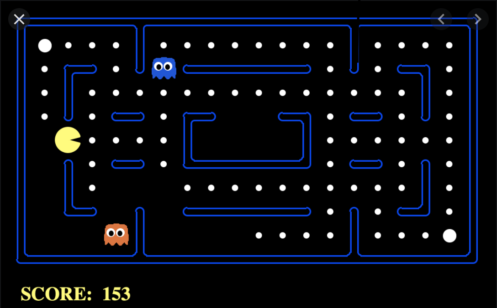
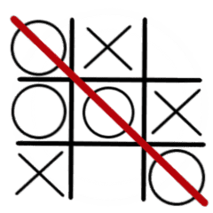

# advance-tic-tac-toe

# 1. Team Member

Group 28

Chen Yulin (3035447398)

Wang ManLin (3035535016)

We have discussed about two games that could be implemented for this project, but cannot decide which one fits the requirement better. Therefore, we enclosed two proposals and we wish to get some feedback from the teaching team.

## Topic1: Pac-Man

### 1. Game Description

In this project, a Pac-Man game will be designed where the user (player) controls the movement of Pac-Man, who must eat all the dots(denoted by ‘o’) inside an enclosed maze while avoiding ghosts (denoted by ‘m’). During the game, the ghosts will randomly move to interrupt the manipulation of the user. Eating a dot will earn 1 score for the user. When all dots are eaten, the user wins. Otherwise, the user loses.

  

### 2. Features to be implemented

#### Generation of game random sets or events

- The locations of the walls will be generated randomly when a new game is launched
- The location of the foods (dots) will be generated randomly when the game is launched and also during the gameplay
- Users will be asked to choose the number of ghosts they would like to play against. If the number of ghosts exceed 4, the positions of the ghosts exceeding 4 will be set randomly

#### Data structures for storing game status

- A 2D char array of the board storing the location of pacman, dots, ghosts and walls and the number of dots
- An array of class Ghost storing information about the ghosts
- A dynamic array of class Dot storing information about the dots
- An array of class Wall storing information about the walls 

#### File input/output

- The game can be paused and the game progress will be kept in the archive as a text (.txt) file. When a new game is launched, the user will be asked whether to continue the game or start a new game. If the user chooses to continue the game, the program will read from the text file that stores the game progress
- A leaderboard (.txt) file storing the top 5 highest scores obtained by the users

#### Dynamic memory management

A dynamic array of class Dot will be implemented to request memory if more dots are generated during the gameplay. The memory will be released at the end of the game 

#### Program codes in multiple files

- main.cpp: execute the game
- pacman.cpp: define Pacman class
- dot.cpp: define Dot class
- wall.cpp: define Wall class
- ghost.cpp: define Ghost class
- constant.h: set all the constants that will be used in the program
- Makefile: to generate targets

## Topic 2: Tic-tac-toe

### 1. Game Description

In this project, a Tic-Tac-Toe game will be designed in which two players take turns to place a chess(O or X) to complete a row, a column, or a diagonal with either three O's or three X's drawn in the spaces of a grid of nine squares. The first one who succeeds in placing three of their marks in a horizontal, vertical, or diagonal row is the winner. 

  

### 2. Features to be implemented

#### Generation of game sets or events

This game will allow users to choose between two different game modes: single-player and two-players. In single-player mode, the user will play against an AI agent at the chosen level (easy, medium and impossible level). While in two-players mode, two users will take turns to move.

#### Data structures for storing game status: 

A 3 * 3 array and a boolean variable (indicating who is the next one to move) will be used to store the game status.

#### File input/output

The game can be paused and the game progress will be kept in the archive as a text (.txt) file. When a new game is launched, the user will be asked whether to continue the game or start a new game. If the user chooses to continue the game, the program will read the text file storing the game progress.

#### Dynamic memory management

* The User is allowed to regret a false move at most once in the whole game, therefore the last game status (including previous move of the user and the opponent) will be kept in the memory.

* Search trees used by AI agents with certain space complexity will be stored in the memory.

#### Program codes in multiple files

* A main.cpp file to execute the game

* A Makefile to compile and run the game on the shell

